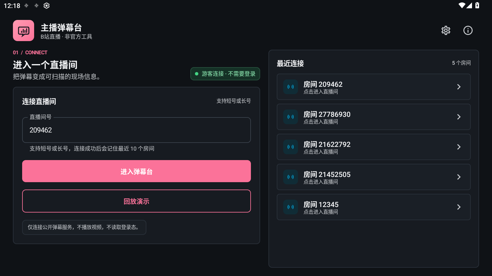
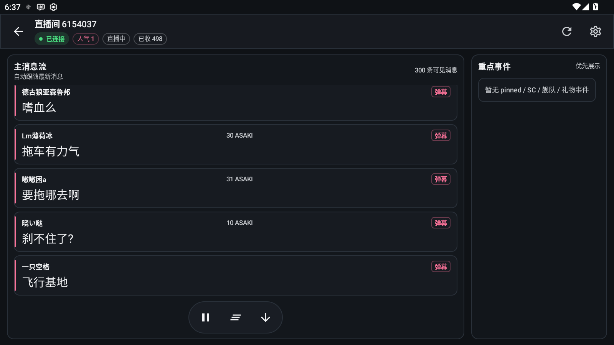
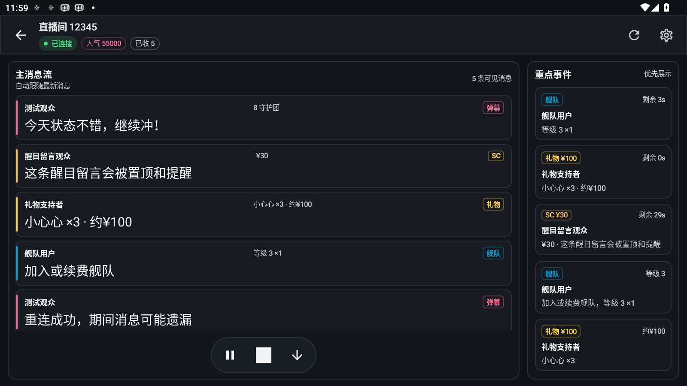
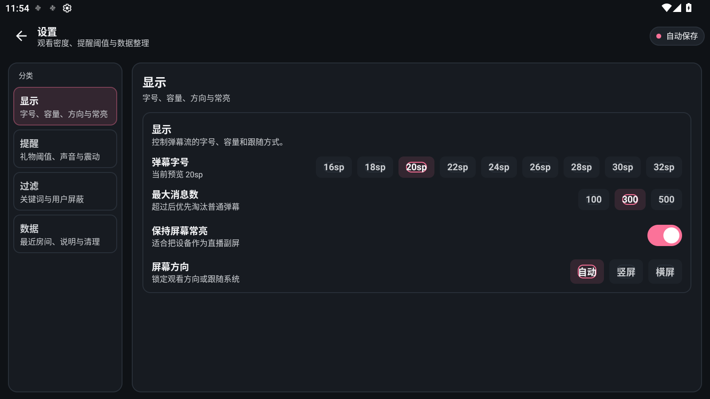
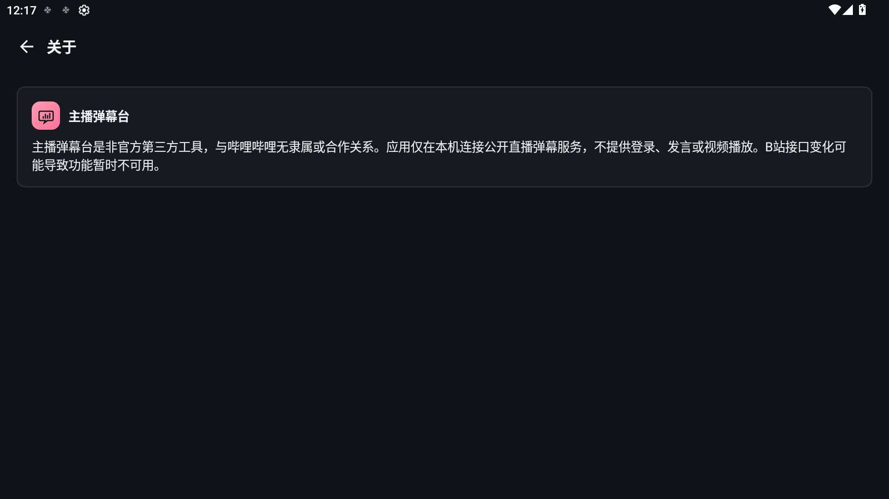

[简体中文](README.md) | English

# Anchor Danmaku (主播弹幕台)

[](https://github.com/juice4927/anchor-danmaku/actions/workflows/ci.yml)
[](LICENSE)
[](#requirements)
[](https://kotlinlang.org)

**A "live information deck" for Bilibili live-stream chat**: use it as a second screen while streaming — real-time danmaku feed, pinned key events (Super Chat / gifts / guard), hardware alerts. **Connects as a guest, no Bilibili account required.**

> Unofficial third-party tool, not affiliated with Bilibili. Connects to the public danmaku service only — no video playback, no sending messages.

## Screenshots

| Connect | Room (live danmaku) |
| --- | --- |
|  |  |

| Demo replay | Settings | About |
| --- | --- | --- |
|  |  |  |

## Features

- **Guest connection**: join public live rooms without logging in; supports short/long room IDs; remembers the last 10 rooms
- **Message feed**: color-coded danmaku / Super Chat / gifts / guard joins with tags; pause, clear, jump to bottom
- **Key events**: SC, high-value gifts and guard purchases pinned with countdown; configurable amount thresholds
- **Hardware alerts**: dedicated high-importance notification channel + sound/vibration, 250 ms throttle
- **Filtering**: keyword blacklist, user blocking (long-press a message), ordinary danmaku evicted first under load
- **Demo replay**: built-in scripted demo data — full experience without network
- **Viewing comfort**: Bilibili-branded dark theme, orientation lock, keep-screen-on, message merge/dedupe
- **Deep link**: `bilibili://live/<roomId>`

## 2025 protocol adaptations

| Date | Change | Adaptation |
| --- | --- | --- |
| 2025-05 | `getDanmuInfo` now requires WBI signing (w_rid/wts) | ✅ `BiliWbiSigner` per the community spec, keys cached daily |
| 2025-06 | Guest connections require a non-empty `buvid3` cookie, otherwise the handshake succeeds but danmaku is **silently filtered** | ✅ Anonymous buvid3/buvid4 fetched from the official fingerprint endpoint on first connect, kept in memory only, propagated through HTTP/WS/auth packet; web-client fields `support_ack`/`scene` added |
| 2025 | Nicknames masked for logged-out viewers (`某***`) | ✅ Server content is rendered as-is |

The anonymous identifier lives only in process memory and never touches account credentials. See [PRIVACY.md](PRIVACY.md).

## Architecture

```text
app (Android/Compose/DataStore)
 └─ core:protocol (Bilibili WebSocket protocol, WBI signing, anonymous identity)
     └─ core:domain (session state machine, reconnect backoff, message pipeline ports)
         └─ core:model (pure-Kotlin domain models)
```

- The three core modules are pure Kotlin/JVM with one-way dependencies; only `app` touches Android APIs
- Connect flow: `room_init` → `getDanmuInfo` (WBI) → WSS host fallback → op=7 auth → 30 s heartbeat
- Message pipeline: dedupe → 3 s merge → filter/threshold → bounded priority buffer (512) → list/pinned
- Defensive protocol implementation: 16-byte big-endian header, zlib/brotli decompression cap of 32 MiB, nesting depth ≤ 4, ≤ 20,000 child packets per frame, host allowlist limited to `*.bilibili.com`

See [docs/architecture.md](docs/architecture.md) and [docs/implementation-log.md](docs/implementation-log.md) (17 phases of TDD records).

## Requirements

- Android 8.0 (API 26)+
- Network access to Bilibili's public danmaku service

## Building from source

Requires JDK 17–21 and Android SDK 34 (Build Tools 34.0.0):

```bash
./gradlew.bat assembleDebug     # outputs app/build/outputs/apk/debug/app-debug.apk
./gradlew.bat installDebug      # install to a connected device/emulator
```

Full quality gate (unit tests + JaCoCo thresholds + Lint + three APK variants + fixture validation + permission gate + 12,000-event perf smoke + APK size check):

```bash
./gradlew.bat verifyAll
```

> **Windows note**: if the project sits under a path containing non-ASCII characters, the forked test executor fails with `ClassNotFoundException` due to system code-page decoding. Clone or move the repository to a pure-ASCII path before running tests (building the APK is unaffected).

## Usage

1. Enter a room ID (short or long) and tap "进入弹幕台" (Enter danmaku deck)
2. Offline? Tap "回放演示" (demo replay) for the full experience
3. Settings (top-right): font size, message capacity, alert thresholds, keyword filters, orientation
4. Room toolbar: pause / clear / jump to bottom; back navigation asks for confirmation before disconnecting

## Status

- v0.1.0, actively developed
- CI: GitHub Actions (JDK 21) runs the full `verifyAll` gate
- Long-run stability on real streams is a manual pre-release step — see the [release checklist](docs/manual-release-checklist.md)

## Contributing

Issues and PRs are welcome. Please make sure `verifyAll` passes before submitting; protocol-behavior changes should come with fixtures or unit tests.

## Disclaimer

This is an unofficial tool, not affiliated with Bilibili. It only connects to the public danmaku service and provides no login, messaging, or video playback. Bilibili API changes may temporarily break functionality. Comply with Bilibili's user agreement and applicable laws.

## License

[MIT](LICENSE)
